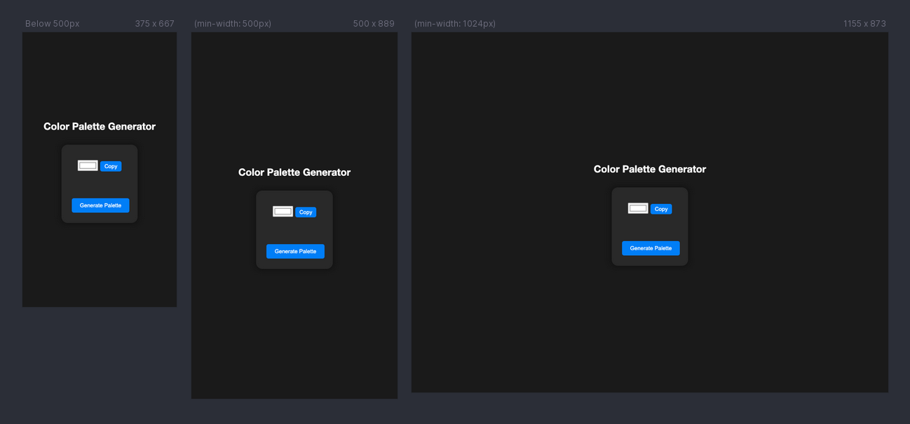

# Color Palette Generator



Generate and explore beautiful color palettes with the Color Palette Generator app. This app allows you to pick colors, create a custom palette, and copy hex codes for your design projects.

## Table of Contents

- [Demo](#demo)
- [Features](#features)
- [Installation](#installation)
- [Usage](#usage)

## Demo

View a live demo of the app [https://color-palette-generator-mht.vercel.app/](#).

## Features

- Select colors using the color picker.
- Build your color palette by adding colors.
- Copy color hex codes to the clipboard.
- Modern and responsive design suitable for both web and mobile views.

## Installation

1. Clone the repository:

   ```bash
   git clone https://github.com/mokammeltanvir/color-palette-generator.git
   cd color-palette-generator
   npm install
   
    ```

## Usage
Run the development server:

```bash
npm run dev
```
2. Open http://localhost:5173/ in your browser.
